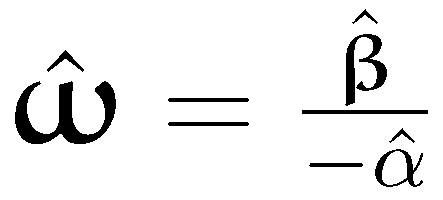
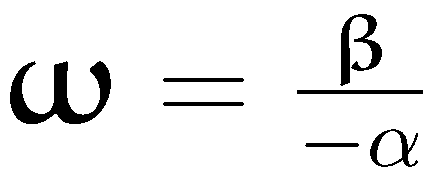
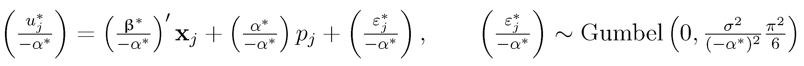
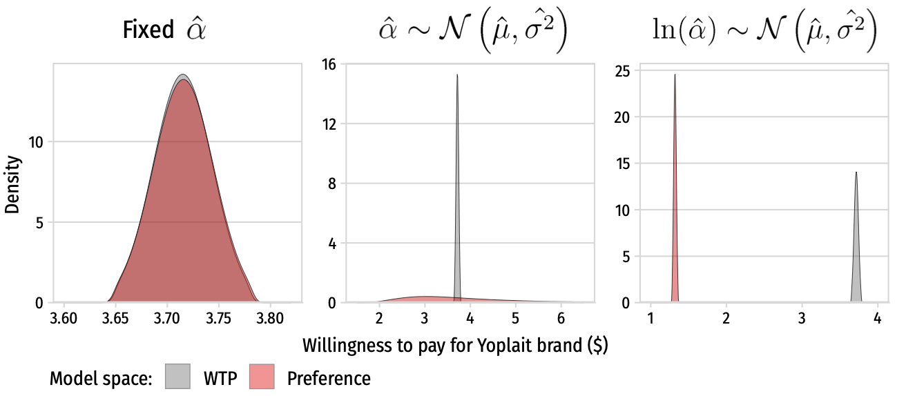

```{r setup, include=FALSE}
library(knitr)
library(fontawesome)
library(tidyverse)
library(metathis)
library(logitr)

options(
  htmltools.dir.version = FALSE,
  knitr.table.format = "html",
  knitr.kable.NA = '',
  dplyr.width = Inf,
  width = 250
)

knitr::opts_chunk$set(
  cache = FALSE,
  warning = FALSE,
  message = FALSE,
  fig.path = "figs/",
  fig.width = 7.252,
  fig.height = 4,
  comment = "#>",
  fig.retina = 3
)

# Setup xaringanExtra options
xaringanExtra::use_xaringan_extra(c(
  "tile_view", "panelset", "share_again"))
xaringanExtra::style_share_again(share_buttons = "none")
xaringanExtra::use_extra_styles(
  hover_code_line = TRUE,
  mute_unhighlighted_code = FALSE
)

# Set up website metadata
meta() %>%
  meta_general(
    description = rmarkdown::metadata$subtitle,
    generator = "xaringan and remark.js"
  ) %>%
  meta_name("github-repo" = "jhelvy/2021-sawtooth-conf") %>%
  meta_social(
    title = rmarkdown::metadata$title,
    url = "https://jhelvy.com",
    og_type = "website",
    og_author = "John Paul Helveston",
    twitter_card_type = "summary_large_image",
    twitter_creator = "@johnhelveston"
  )

knitr::opts_chunk$set(
    warning = FALSE,
    message = FALSE,
    comment = "#>",
    fig.path = "figs/",
    fig.retina = 3 # Better figure resolution
)
```

layout: true

<!-- this adds the link footer to all slides, depends on my-footer class in css-->

<div class="footer-small">
<span>
https://github.com/jhelvy/2021-sawtooth-conf
</span>
</div>

---

name: title-slide
class: inverse, middle
background-image: url(images/blue.jpg)

## The {logitr} `r fa("r-project", fill = "white")` Package: <a href='https://jhelvy.github.io/logitr/'></a>
## Obtaining Willingness to Pay Estimates from Preference Space and Willingness to Pay<br>Space Utility Models

### by John Paul Helveston

Sawtooth Software Conference: Turbo Choice Modeling Seminar

April 20, 2021

---

class: center, middle

# Which would you choose?

.cols4[
## .center[$2.49]
<center>

</center>
]

.cols4[
## .center[$2.99]
<center>

</center>
]

.cols4[
## .center[$1.99]
<center>

</center>
]

.cols4[
## .center[$3.99]
<center>

</center>
]

---

# .center[Estimate marginal utilities]

</br>

<center>

</center>

--

.code100[
```{r, echo=FALSE}
mnl_pref <- readRDS(here::here("models", "mnl_pref.Rds"))
getCoefTable(mnl_pref)
```
]

---

# .center[Convert marginal _utilities_ to marginal _WTPs_]

</br>

<center>

</center>

--

.code100[
```{r, echo=FALSE}
wtp_mnl_pref <- readRDS(here::here("models", "wtp_mnl_pref.Rds"))
result <- wtp_mnl_pref[2:4,]
result[,1] <- result[,1]*-1
result
```
]

---

class: center

## Alternative approach: **Estimate a WTP-Space Model**

.leftcol30[
</br>
## Substitutions:

<center>
</br>

</center>
]

.rightcol70[
## "Preference Space"

<center>

</center>

## "WTP Space"

<center>

</center>
]

---

class: center

**_Quick aside about error scale_**

<center>

</center>

--

**Preference Space**

<center>


</center>

--

**WTP Space**

<center>


</center>

---

class: center, middle

# What's wrong with

<center>
</br>
</center>

# ?

---

## .center[Oops...WTP has undefined mean and variance]

.leftcol35[
</br></br>
<center>

</center>
]

.rightcol65[
</br></br>
$\hat{\alpha}$ & $\hat{\beta}$ are assumed to have asymptotically normal distributions .gray[(Bockstael and Strand, 1987)]

Implies error around $\hat{\omega}$ follows a</br>[Cauchy distribution](https://en.wikipedia.org/wiki/Cauchy_distribution)
]

---

## .center[**Mixed logit**]
## .center[Unreasonably large WTP variance across population]

</br>

.leftcol40[
<center>

</center>
]

.rightcol60[
<center>

</br>

</center>
]

---

### .center[Preference space model produces unreasonably large variance in WTP]

.leftcol[
<center>
Preference Space

</center>
]

.rightcol[
<center>
WTP Space

</center>
</br>
]

<center>

</center>


---

class: inverse
background-image: url(images/blue.jpg)

<br>

# .center[.font150[Thanks!]]

### {logitr} documentation: https://jhelvy.github.io/logitr/

### Slides: https://jhelvy.github.io/2021-sawtooth-conf

.footer-large[
.right[
@johnhelveston `r fa(name = "twitter", fill = "white")`<br>
@jhelvy `r fa(name = "github", fill = "white")`<br>
@jhelvy `r fa(name = "weixin", fill = "white")`<br>
jhelvy.com `r fa(name = "link", fill = "white")`<br>
jph@gwu.edu `r fa(name = "paper-plane", fill = "white")`
]]
