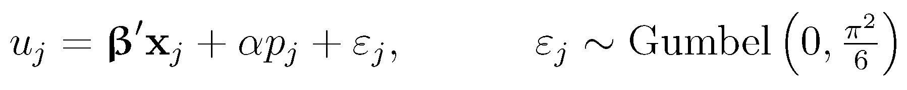
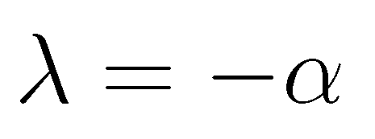
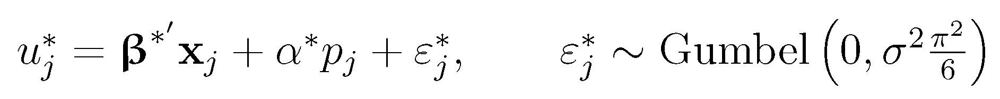
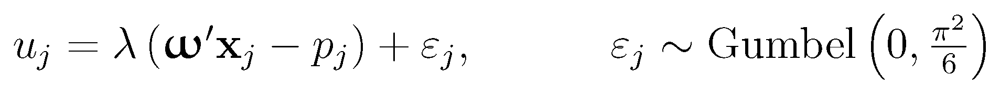

```{r setup, include=FALSE}
library(knitr)
library(fontawesome)
library(tidyverse)
library(metathis)
library(logitr)

options(
  htmltools.dir.version = FALSE,
  knitr.table.format = "html",
  knitr.kable.NA = '',
  dplyr.width = Inf,
  width = 250
)

knitr::opts_chunk$set(
  cache = FALSE,
  warning = FALSE,
  message = FALSE,
  fig.path = "figs/",
  fig.width = 7.252,
  fig.height = 4,
  comment = "#>",
  fig.retina = 3
)

# Setup xaringanExtra options
xaringanExtra::use_xaringan_extra(c(
  "tile_view", "panelset", "share_again"))
xaringanExtra::style_share_again(share_buttons = "none")
xaringanExtra::use_extra_styles(
  hover_code_line = TRUE,
  mute_unhighlighted_code = FALSE
)

# Set up website metadata
meta() %>%
  meta_general(
    description = rmarkdown::metadata$subtitle,
    generator = "xaringan and remark.js"
  ) %>%
  meta_name("github-repo" = "jhelvy/2021-sawtooth-conf") %>%
  meta_social(
    title = rmarkdown::metadata$title,
    url = "https://jhelvy.com",
    og_type = "website",
    og_author = "John Paul Helveston",
    twitter_card_type = "summary_large_image",
    twitter_creator = "@johnhelveston"
  )

knitr::opts_chunk$set(
    warning = FALSE,
    message = FALSE,
    comment = "#>",
    fig.path = "figs/",
    fig.retina = 3 # Better figure resolution
)

# Read in results from estimated models
mnl_pref <- readRDS(here::here("models", "mnl_pref.Rds"))
mnl_wtp <- readRDS(here::here("models", "mnl_wtp.Rds"))
wtp_mnl_pref <- readRDS(here::here("models", "wtp_mnl_pref.Rds"))
```

layout: true

<!-- this adds the link footer to all slides, depends on my-footer class in css-->

<div class="footer-small">
<span>
https://github.com/jhelvy/2021-sawtooth-conf
</span>
</div>

---

name: title-slide
class: inverse, middle
background-image: url(images/blue.jpg)

# The `logitr` `r fa("r-project", fill = "white")` Package: <a href='https://jhelvy.github.io/logitr/'></a>

## Obtaining Willingness to Pay Estimates from Preference Space and Willingness to Pay<br>Space Utility Models

### by John Paul Helveston

Sawtooth Software Conference: Turbo Choice Modeling Seminar

April 20, 2021

---

class: center

# Which would you choose?

.cols4[
## .center[$2.49]
<center>

</center>
]

.cols4[
## .center[$2.99]
<center>

</center>
]

.cols4[
## .center[$1.99]
<center>

</center>
]

.cols4[
## .center[$3.99]
<center>

</center>
]

---

# .center[Estimate marginal utilities]

</br>

<center>

</center>

--

.code100[
```{r, echo=FALSE}
getCoefTable(mnl_pref)
```
]

---

# .center[Convert marginal _utilities_ to marginal _WTPs_]

</br>

<center>

</center>

--

.code100[
```{r, echo=FALSE}
result <- wtp_mnl_pref[2:4,]
result[,1] <- result[,1]*-1
result
```
]

---

class: center

## Alternative approach: **Estimate a WTP-Space Model**

.leftcol30[
## Substitutions:

<center>
</br>

</center>
]

.rightcol70[
## "Preference Space"

<center>

</center>

## "WTP Space"

<center>

</center>
]

---

class: center, middle, inverse

# What's the difference?

.leftcol[
## Preference Space
<center>

</center>
.font200[&darr;]
<center>
</br>
</center>
]

.rightcol[
## WTP Space
</br></br>
<center>

</center>
]


---

## .center[Oops...WTP has undefined mean and variance]

</br>

.leftcol35[
<center>

</center>
.center[.font200[&darr;]]
<center>
</br>
</center>
]

.rightcol60[
</br>
$\hat{\alpha}$ & $\hat{\beta}$ are assumed to have asymptotically normal distributions .gray[(Bockstael and Strand, 1987)]

Implies error around $\hat{\omega}$ follows a</br>[Cauchy distribution](https://en.wikipedia.org/wiki/Cauchy_distribution)
]

---

class: center 

## **Mixed logit**:
## Unreasonably large WTP variance across population

</br>

.leftcol40[
<center>

</center>
.center[.font200[&darr;]]
<center>
</br>
</center>
]

.rightcol60[
<center>

</br>

</center>
]

---

background-color: #fff
class: center

### Preference space model produces unreasonably large variance in WTP

.leftcol[
<center>
Preference Space

</center>
]

.rightcol[
<center>
WTP Space

</center>
</br>
]

<center>

</center>

---

# .center[What others have found]

--

.cols3[
.center[WTP computed from preference space model has undefined moments]

.font60[
- **Carson and Czajkowski (2019)**. "A new baseline model for estimating willingness to pay from discrete choice models." _Journal of Environmental Economics and Management_, 95:57–61.
]]

--

.cols3[
.center[Preference space model produces unreasonably large variance in WTP]

.font60[
- **Train and Weeks (2005)**. "Discrete Choice Models in Preference and Willingness-to-Pay Space". In _Appl. Simul. Methods Environ. Resour. Econ._, Chapter 1, pages 1–16.
- **Sonnier, Ainslie, & Otter (2007)**. "Heterogeneity distributions of willingness-to-pay in choice models." _Quant. Mark. Econ._, 5(3):313–331.
]]

--

.cols3[
.center[Neither space systematically predicts choice better]

.font60[
- **Sonnier et al. (2007)** and **Train and Weeks (2005)** found preference space model fit data better.
- **Das et al. (2009)** found nearly identical model fit on out-of-sample predictions with each model specification.
]]

---

class: center 

# .fancy[Practical Considerations]

> ### WTP space models produce immediately interpretable results</br>(with correct standard errors)

--

.leftcol[.code60[
Unit: "Utility" (relative)

<center>

</center>

```{r, echo=FALSE}
getCoefTable(mnl_pref)
```
]]

--

.rightcol[.code60[
Units: $ (absolute)

<center>

</center>

```{r, echo=FALSE}
result <- wtp_mnl_pref[2:4,]
result[,1] <- result[,1]*-1
result
```
]]

---

class: center 

# .fancy[Practical Considerations]

> ### WTPs can be directly compared across different models</br>(even estimates from different data sets)

---

class: center

**_Quick aside about error scale_**

<center>

</center>

--

**Preference Space**

<center>


</center>

--

**WTP Space**

<center>


</center>

---

class: center 

# .fancy[Practical Considerations]

> ### WTPs can be directly compared across different models</br>(even estimates from different data sets)

.leftcol[
**Preference Space**

Parameters proportional to $\sigma$

<center>


</center>
]

--

.rightcol[
**WTP Space**

Parameters independent of $\sigma$

<center>


</center>
]

---

class: center 

# .fancy[Practical Considerations]

> ### No theoretical basis for believing that marginal _utilities_ versus marginal _WTPs_ should follow standard distributions

.leftcol[
<center>

</center>
]

.rightcol[
<center>

</center>
]

---

class: center, middle

# Most software is built for 

<center>

</center>

# not

<center>

</center>

---

class: center, middle, inverse 

# `logitr` to the rescue!

<center>

</center>

---

# The logitr `r fa("r-project", fill = "#165CAA")` Package <a href='https://jhelvy.github.io/logitr/'></a>

### Estimation of multinomial and mixed logit models in with "Preference" space or "Willingness-to-pay" (WTP) space utility parameterizations.

- Homogeneous multinomial logit models.
- Heterogeneous mixed logit models (normal and log-normal parameter distributions).
- Preference & WTP space utility parameterizations.
- Optional multistart optimization loop.
- Computing and comparing WTP from preference space and WTP space models.
- Simulating expected shares.

---

# .center[Installation]

.leftcol70[
Version 0.1.0 can be installed from the CRAN:

```{r, eval=FALSE}
install.packages("logitr")
```

The development version can be installed from GitHub:

```{r, eval=FALSE}
# install.packages("remotes")
remotes::install_github("jhelvy/logitr")
```

https://github.com/jhelvy/logitr
]

---

# .center[Data format]

Data must be arranged in a "long" format: 

- Each row is an alternative from a choice observation. 
- Choice observations do _not_ have to be symmetric. 

Required variables: 

- `choiceName`: A dummy variable for the chosen alternative (`1` or `0`).
- `obsIDName`: A sequence of repeated numbers identifying each unique choice observation, e.g. `1, 1, 2, 2, 3, 3`.
- `parNames`: Any other variables to use as model covariates. 

---

# .center[Data format]

.leftcol[
```{r, eval=FALSE}
head(yogurt, 10)
```
```{r, echo=FALSE}
yogurt %>% 
  select(choice, obsID, alt, price, brand) %>% 
  head(10) %>% 
  as.data.frame()
```
]

.rightcol[
- `choiceName = "choice"`
- `obsIDName = "obsID"`
- `parNames = c("price", "brand")`
]

---

# .center[Multinomial logit in **Preference Space**]

.leftcol45[
```{r, eval=FALSE}
library(logitr)

mnl_pref <- logitr(
  data       = yogurt,
  choiceName = "choice",
  obsIDName  = "obsID",
  parNames   = c("price", "brand"))
)
```
]

--

.rightcol55[.code50[
```{r}
summary(mnl_pref)
```
]]

---

# .center[Multinomial logit in **WTP Space**]

.leftcol45[
```{r, eval=FALSE}
library(logitr)

mnl_wtp <- logitr(
  data       = yogurt,
  choiceName = "choice",
  obsIDName  = "obsID",
  parNames   = "brand", #<<
  priceName  = "price",  #<<
  modelSpace = "wtp") #<<
)
```
]

--

.rightcol55[.code50[
```{r, eval=FALSE}
summary(mnl_wtp)
```
```{r, echo=FALSE}
summary(mnl_wtp$bestModel)
```
]]

---

# .center[Get WTP from Preference Space model]

</br>

.leftcol35[
<center>

</center>
]

.rightcol60[
```{r}
wtp(mnl_pref, priceName = "price")
```
]

---

# .center[Comparing WTP]

### .center[Compare WTP from Preference space and WTP space models]

.leftcol60[
```{r}
wtpCompare(mnl_pref, mnl_wtp, priceName = "price")
```
]


---

class: inverse
background-image: url(images/blue.jpg)

<br>

# .center[.font150[Thanks!]]

### `logitr` documentation: https://jhelvy.github.io/logitr/

### Slides: https://jhelvy.github.io/2021-sawtooth-conf

.footer-large[
.right[
@johnhelveston `r fa(name = "twitter", fill = "white")`<br>
@jhelvy `r fa(name = "github", fill = "white")`<br>
@jhelvy `r fa(name = "weixin", fill = "white")`<br>
jhelvy.com `r fa(name = "link", fill = "white")`<br>
jph@gwu.edu `r fa(name = "paper-plane", fill = "white")`
]]


